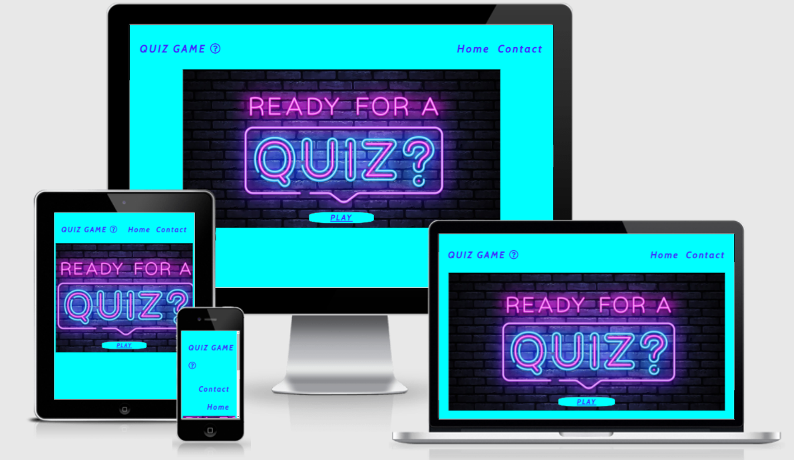

# Quiz Game 
Quiz Game is a game for friends and family to brush up on their general knowledge by answering questions on one or more topics. This quiz will help use what you already know while piqueing your curiosity in learning about new topics and also making it fun to learn.

Users of the game will learn the rules on how to play the Quiz Game and be able to use what they learn in their own lives when talking to friends about fun facts they learnt after playing the game. This site is targeted at children and adults alike as it is a clear app for learning, practicing, and having fun.

# Features 
## Existing Features
- Header
    - Spotlighted at the top of the page, the header shows the game name; Quiz Game with a fun font that compares favorably with the background.
    - The heafer clearly informs the user what game they are playing.
