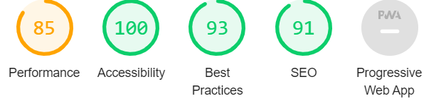

# Quiz Game 
Quiz Game is a game for friends and family to brush up on their general knowledge by answering questions on one or more topics. This quiz will help use what you already know while piqueing your curiosity in learning about new topics and also making it fun to learn.

Users of the game will learn the rules on how to play the Quiz Game and be able to use what they learn in their own lives when talking to friends about fun facts they learnt after playing the game. This site is targeted at children and adults alike as it is a clear app for learning, practicing, and having fun.

# Author
### Ion Simion 

# Table of Contents
- [Quiz Game](#quiz-game)
- [Author](#author)
- [Table of Contents](#table-of-contents)
- [Features](#features)
    - [Existing Features](#existing-features)
- [The Game Results](#the-game-results)
- [The Footer](#the-footer)
    - [Features left to Implement](#features-left-to-implement)
- [Testing](#testing)
- [Bugs](#bugs)
    - [Solved Bugs](#solved-bugs)
    - [Unfixed Bugs](#unfixed-bugs)
- [Validator Testing](#validator-testing)
- [Deployment](#deployment)
- [Credits](#credits)
- [Acknowledgements](#acknowledgements)

# Features 
## Existing Features
- Header
    - Spotlighted at the top of the page, the header shows the game name; Quiz Game with a fun font that compares favorably with the background.
    - The header also contains a contact me link for users to use if they find any issues while playing the game.
    - The header clearly informs the user what game they are playing.
    

    

### 

# The Game Results 
- The Game options includes clear instrustions on how to play the game before you start the quiz.
- The user is given a question which they have to answer within 15seconds, if the user runs out of timethe game will automatically show you the correct answer in green.
- If they guess correctly the correct answer will display in green.
- However, if the user guesses incorrectly it will appear in red and the correct answer will be shown in green. 
- At the end of the quiz the game will announce to the user how many correct answers they got.
- The score is clearing shown to the user, making the game easy to play and understand.

# The Footer
- This section shows the user how many questions they have completed and how many more the have to answer.
- The footer also contains a button to move onto the next question.

## Features Left to Implement 
- When I have more time, I would like to expand the quiz by adding more general knowledge questions.

# Testing
- I tested this game in different internet browers such as Google Chrome, Microsoft anf Safari.
- I double-checked that the wording in the header, directions, options, results, and footer is clear and understandable.
- By running it through lighthouse in devtools, I validated that the colors and fonts chosen are easily readable and visible.
- This project is responsive, looks good, and works on a typical screen widths, according to my testing.

# Bugs
## Solved Bugs
- When I inserted the image for my quiz game it was not assessable on all different screen sizes (IphoneX).
- I discovered this was because I didn't give background-size: cover for the image.
## Unfixed Bugs
- No unfixed bugs

# Validator Testing
- Java Script
    - No errors were returened.
- HTML
    - [Link Here](https://validator.w3.org/nu/?doc=https%3A%2F%2Fion71229.github.io%2FMilestone-2%2F)
- CSS
    - [Link Here](https://jigsaw.w3.org/css-validator/validator?uri=https%3A%2F%2Fion71229.github.io%2FMilestone-2%2F&profile=css3svg&usermedium=all&warning=1&vextwarning=&lang=en)

# Deployment
'GitHub Pages' was used for publishing the website. The procedure was as follows:

1. Login to the [GitHub](https://github.com/) website.
2. On the left side of your screen, you can find a summary of all your repositories. [Here is mine.](https://github.com/Ion71229/Milestone-2)
3. You can find a ribbon on the top of your screen. In the ribbon, click on 'Settings'.
4.  In the selection menu on the left side of your screen, click on 'Pages'.
5. Beneath 'Source' you will find a small pull-down menu. 
6. Click on it and select 'main/master', then press the 'Save' button.
7. You will get automatically redirected to the 'GitHub Pages' page. There you will see a blue text box telling the site will be published.
8. Refresh the page after a minute and when this text box turns green, the website has been published.
9. Click the link in the green text box to go to your published website.

# Credits
I used the following websites for my project:
- [Google](https://www.google.com/)
- [Font-awesome](https://fontawesome.com/)
- [Google-Fonts](https://fonts.google.com/?preview.text=menu&preview.text_type=custom)
- [Slack](https://slack.com/signin#/signin)
- [Quiz Game Image](https://canopylab.com/working-with-adaptive-quizzes-a-beginners-guide/)

# Acknowledgements
I would like to thank my mentor Adegbenga Adeye and the slack community for their great advice, tips and the code review.